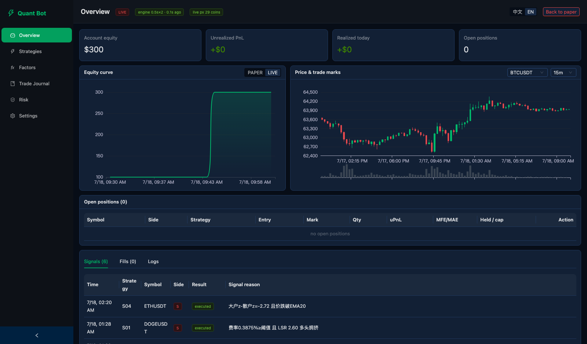
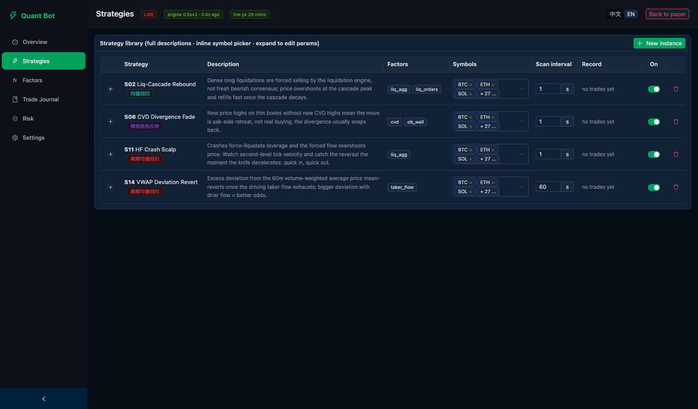
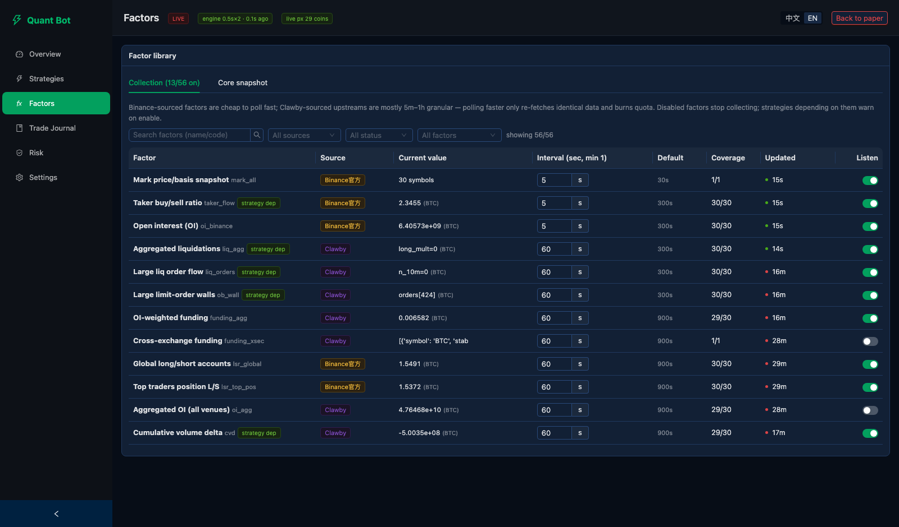
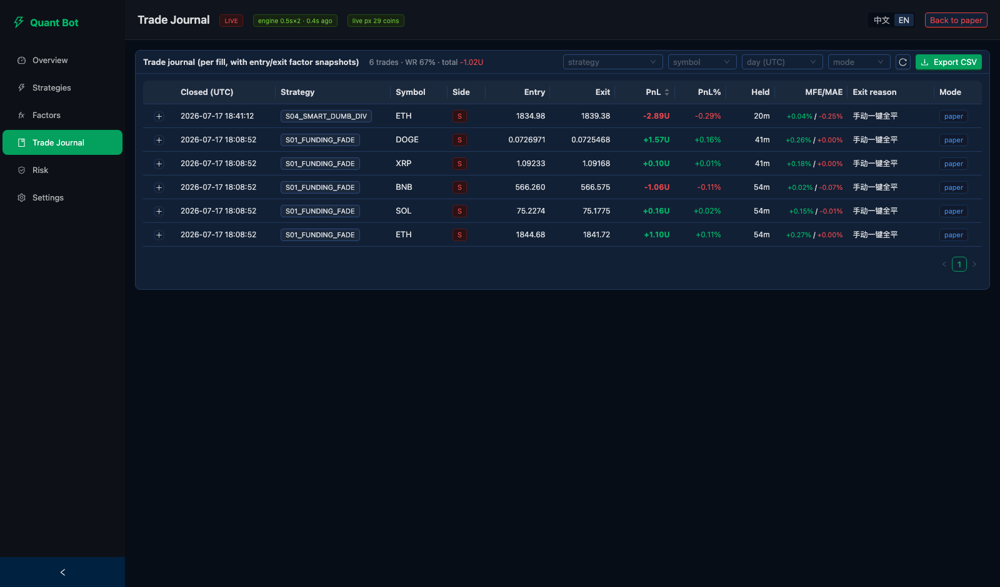
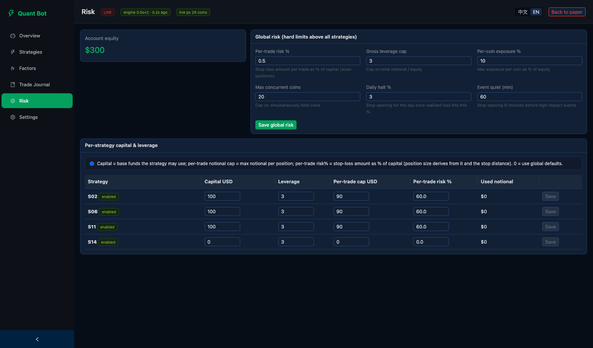

# ⚡ Quant Bot — Crypto Perpetuals Trading System

**English** | [中文](#-quant-bot--加密货币永续合约量化交易系统)

A self-hosted, full-stack quantitative trading system for crypto USDT-perpetuals.
Factor-driven strategies, a replay-accurate backtesting engine, multi-exchange
execution, and a bilingual real-time dashboard — everything runs locally, your
API keys never leave your machine.

> ⚠️ **Disclaimer**: This software is for research and education. Crypto
> derivatives trading carries substantial risk of loss. Backtest results do not
> guarantee future returns. Use paper mode first; go live at your own risk.

---

## 📸 Screenshots

**Overview — segregated paper/live equity curves, price chart with trade marks**



**Strategy library — full descriptions, factor dependencies, inline symbol picker, per-instance params**



**Factor library — 56 factors with live values, listen switches, search & filters**



**Trade journal — per-fill records with entry/exit factor snapshots, CSV export**



**Risk controls — global hard limits + per-strategy capital & leverage**



## ✨ Features

- **4 production strategies** (liquidation-cascade rebound, CVD divergence fade,
  HF crash scalp on second-level ticks, VWAP deviation revert) — clone any
  template into multiple instances with independent params/symbols/capital.
- **56-factor library**: Binance official (OI, long/short ratios, taker flow,
  basis) + Clawby-aggregated (cross-venue liquidations, funding, CVD, orderbook
  walls, options PCR, stablecoin mcap, on-chain SOPR/NUPL, Hyperliquid whales…).
  Per-factor listen switch, live value, poll interval, search & filters.
- **Replay-accurate backtester**: drives the *live strategy classes* over
  historical data (zero logic drift), anti-lookahead by construction, real cost
  model (taker fee + slippage + funding), IS/OOS split, parameter plateau
  selection against overfitting, second-level aggTrades replay for HF
  strategies. One command: `python -m backend.backtest all`.
- **Multi-exchange execution**: market data & factors are Binance-based; live
  orders route to **Binance / Bitget / OKX** (global switch in Settings, with
  contract-size and 1000x-ticker mapping handled).
- **Paper / live strictly segregated**: separate equity curves, positions,
  stats, journal filtering. Paper is the default; going live requires typing
  `LIVE` to confirm.
- **Risk layers**: per-trade risk sizing, gross leverage cap, per-coin exposure
  cap, max concurrent coins, daily loss circuit-breaker, macro-event quiet
  window, fear & greed position scaling.
- **Bilingual UI** (English / 中文, one-click toggle) with dark theme.
- **AI-ready trade journal**: every close appends a JSONL row with entry/exit
  factor snapshots and MFE/MAE — built for post-trade analysis.

## 🗂 Project Structure

```
quant-bot/
├── run.sh                     # one-command launcher (port 8899)
├── requirements.txt           # Python deps (FastAPI, httpx, websockets, PyYAML)
├── strategies.yaml            # strategy instances / params / risk / universe
├── .env.example               # credentials template — copy to .env
├── FACTORS.md                 # factor catalog documentation
├── STRATEGIES.md              # strategy design documentation
├── backend/
│   ├── main.py                # FastAPI app: REST API + static frontend + engine boot
│   ├── engine.py              # two 0.5s loops: signal scan + position management
│   ├── strategies.py          # strategy classes (S02/S06/S11/S14) + registry
│   ├── factors.py             # 56-factor registry + due-based async collector
│   ├── risk.py                # global risk layer (every entry passes through)
│   ├── executor.py            # paper simulator / live order routing
│   ├── exchanges.py           # Bitget & OKX execution clients (sizing, mapping)
│   ├── binance.py             # Binance REST (market data + signed trading)
│   ├── clawby.py              # Clawby relay client (throttled)
│   ├── ws.py                  # bookTicker WebSocket: real-time prices + tick buffer
│   ├── db.py                  # SQLite storage (factors, positions, equity, meta)
│   ├── journal.py             # JSONL trade journal writer
│   ├── config.py              # .env + strategies.yaml management (hot-reload)
│   └── backtest/
│       ├── data.py            # historical data downloader + local cache
│       ├── sim.py             # virtual clock / factor slicing / module patching
│       ├── broker.py          # simulated fills, fees, funding, exits
│       ├── runner.py          # replay main loop + metrics
│       ├── optimize.py        # grid search + IS/OOS + plateau selection
│       ├── report.py          # markdown reports + suggested config
│       └── tests/             # 22 regression tests
└── frontend/                  # React 18 + Ant Design 5 + ECharts dashboard
    └── src/
        ├── i18n.jsx           # zh/en dictionaries
        ├── pages/             # Overview / Strategies / Factors / Journal / Risk / Settings
        └── panels/            # reusable widgets (charts, tables, editors)
```

## 🚀 Quick Start

**Prerequisites**: Python ≥ 3.10 · Node.js ≥ 20 · a Binance account with a
futures-enabled API key (withdrawals OFF, IP whitelist ON recommended) · a
[Clawby](https://openclawby.com) API key for aggregated data factors.

```bash
# 1. Configure credentials
cp .env.example .env && chmod 600 .env
#    edit .env: CLAWBY_API_KEY, BINANCE_API_KEY, BINANCE_SECRET_KEY

# 2. Launch (first run auto-creates .venv, installs deps, builds the frontend)
./run.sh
#    custom port: ./run.sh 8080

# 3. Open the dashboard
open http://127.0.0.1:8899
```

The bot starts in **paper mode** with a $10,000 virtual balance. Verify
credentials in *Settings → API credentials → Test connection*, watch factors
populate on the *Factors* page, then enable strategies in *Strategies*.

### Manual setup (if you prefer)

```bash
python3 -m venv .venv && ./.venv/bin/pip install -r requirements.txt
cd frontend && npm install && npm run build && cd ..
./.venv/bin/uvicorn backend.main:app --port 8899
```

## ⚙️ Configuration

| Where | What |
|---|---|
| `.env` | API credentials (editable at runtime in *Settings*, hot-reloaded) |
| `strategies.yaml` | universe, global risk limits, per-instance params — every field editable from the UI |
| *Settings → Live execution venue* | route live orders to Binance / Bitget / OKX |
| *Factors* page | per-factor listen switch + poll interval (Binance factors are cheap to poll fast; Clawby upstreams are 5m–1h granular) |

**Going live**: click *Go LIVE* in the header and type `LIVE`. Fund your
futures wallet first; a strategy with `capital_usd: 0` sizes from the whole
account equity. Start small.

## 📊 Backtesting

```bash
# download 30d of history (Binance retains some series only 30 days — run soon)
./.venv/bin/python -m backend.backtest download

# single strategy, default params
./.venv/bin/python -m backend.backtest run --sid S14_VWAP_REVERT

# full pipeline: grid search + IS/OOS validation + reports
./.venv/bin/python -m backend.backtest all --workers 6
# -> backtest/reports/<date>/SUMMARY.md + per-strategy reports
#    + strategies.suggested.yaml (never touches your live config)
```

Methodology highlights: replays the live strategy code via module injection;
factors are truncated to completed buckets only (no lookahead); exits follow a
pessimistic same-bar rule; costs include taker fees, slippage tiers and real
funding settlements; parameters are picked by *neighborhood plateau median*,
not single-point maxima; OOS runs once, on the picked params only.

## 🧪 Tests

```bash
./.venv/bin/pip install pytest
./.venv/bin/python -m pytest backend/backtest/tests/ -q     # 22 tests
```

## 🔒 Security Notes

- `.env` is chmod-600 and git-ignored; keys are masked in the UI and never
  leave your machine (exchanges are called directly, no third-party relay for
  trading).
- Disable withdrawals and bind an IP whitelist on every exchange key.
- Paper and live data are stored with a `mode` tag and never mixed.

---
---

# ⚡ Quant Bot — 加密货币永续合约量化交易系统

[English](#-quant-bot--crypto-perpetuals-trading-system) | **中文**

自托管的全栈加密货币 USDT 永续合约量化交易系统:因子驱动策略、回放级精确的回测
引擎、多交易所执行、中英双语实时控制台——全部本地运行,API 密钥不出你的机器。

> ⚠️ **免责声明**:本软件仅用于研究与学习。加密货币衍生品交易存在重大亏损风险,
> 回测结果不代表未来收益。请先使用模拟盘;切换实盘风险自负。

## 📸 界面预览

界面截图见上方英文部分(共 5 张):**总览**(模拟/实盘权益曲线分离、行情与开平
仓标记)、**策略库**(完整描述、依赖因子、行内币种多选、实例参数编辑)、
**因子库**(56 因子实时值、监听开关、搜索筛选)、**交易日志**(逐笔记录含因子
快照、CSV 导出)、**风控**(全局硬约束 + 各策略资金杠杆)。

## ✨ 核心特性

- **4 个生产策略**(爆仓瀑布接针、CVD 背离反转、秒级高频接针、VWAP 偏离回归),
  支持模板实例化:同一策略可克隆多个实例,各自独立配置参数/币种/资金。
- **56 因子库**:Binance 官方(OI、多空比、taker 流、基差)+ Clawby 聚合
  (跨所爆仓、聚合费率、CVD、挂单墙、期权 PCR、稳定币市值、链上 SOPR/NUPL、
  Hyperliquid 鲸鱼等),每因子独立监听开关、实时值、采集频率、搜索与筛选。
- **回放级回测引擎**:直接驱动实盘策略类(零逻辑漂移),构造性防未来函数,
  真实成本模型(taker 手续费+滑点+资金费),IS/OOS 切分 + 参数高原选参防过拟合,
  高频策略按 aggTrades 秒级回放。一条命令:`python -m backend.backtest all`。
- **多交易所执行**:行情与因子以 Binance 为数据基准,实盘单可路由至
  **Binance / Bitget / OKX**(配置页全局切换,张数换算与 1000 倍合约映射已处理)。
- **模拟盘/实盘严格隔离**:权益曲线、持仓、战绩、日志按模式分开存储与展示;
  默认模拟盘,切实盘需输入 `LIVE` 二次确认。
- **多层风控**:单笔风险定仓、总杠杆上限、单币敞口上限、并发币数上限、
  日内亏损熔断、宏观事件静默窗口、恐贪极值仓位缩放。
- **中英双语界面**(一键切换)+ 暗色主题。
- **AI 友好交易日记**:每笔平仓写入 JSONL,含开平仓因子快照与 MFE/MAE,
  为策略复盘与优化而设计。

## 🗂 项目结构

结构树见上方英文部分——`backend/` 为 FastAPI 后端(引擎/策略/因子/风控/执行/
回测),`frontend/` 为 React + Ant Design + ECharts 控制台,`strategies.yaml`
是策略配置的唯一事实源(UI 修改热生效)。

## 🚀 快速开始

**环境要求**:Python ≥ 3.10 · Node.js ≥ 20 · 开通合约权限的 Binance API key
(建议关闭提现、绑定 IP 白名单)· [Clawby](https://openclawby.com) API key
(聚合数据因子用)。

```bash
# 1. 配置凭据
cp .env.example .env && chmod 600 .env
#    编辑 .env 填入 CLAWBY_API_KEY、BINANCE_API_KEY、BINANCE_SECRET_KEY

# 2. 一键启动(首次运行自动创建 .venv、安装依赖、构建前端)
./run.sh          # 自定义端口: ./run.sh 8080

# 3. 打开控制台
open http://127.0.0.1:8899
```

启动后默认**模拟盘**($10,000 虚拟本金)。先在「配置 → API 凭据 → 测试连接」
验证密钥,在「因子库」确认数据流入,再到「策略库」启用策略。

## ⚙️ 配置说明

| 位置 | 内容 |
|---|---|
| `.env` | API 凭据(配置页可在线修改,热生效) |
| `strategies.yaml` | 监控币池、全局风控、各策略实例参数——全部可在 UI 修改 |
| 配置 → 实盘执行交易所 | 实盘单路由:Binance / Bitget / OKX |
| 因子库页面 | 各因子监听开关与采集频率(Binance 系可调快;Clawby 上游为 5m~1h 粒度,调快只会重复消耗额度) |

**切换实盘**:点击顶栏「切换实盘」并输入 `LIVE` 确认。请先向合约钱包划转资金;
策略 `capital_usd: 0` 表示按全账户净值定仓。请从小资金开始。

## 📊 回测

```bash
# 下载 30 天历史数据(Binance 部分序列仅保留 30 天,建议尽快执行)
./.venv/bin/python -m backend.backtest download

# 单策略默认参数回测
./.venv/bin/python -m backend.backtest run --sid S14_VWAP_REVERT

# 完整管线:网格搜索 + IS/OOS 验证 + 报告
./.venv/bin/python -m backend.backtest all --workers 6
# -> backtest/reports/<日期>/SUMMARY.md + 各策略报告
#    + strategies.suggested.yaml(不会改动你的生产配置)
```

方法论要点:模块注入方式回放实盘策略代码;因子仅用已完结数据桶(无未来函数);
出场按同 bar 悲观规则;成本含 taker 手续费、分档滑点与真实资金费结算;
选参用邻域高原中位数而非单点最优;OOS 仅对入选参数运行一次。

## 🧪 测试

```bash
./.venv/bin/pip install pytest
./.venv/bin/python -m pytest backend/backtest/tests/ -q     # 22 个测试
```

## 🔒 安全说明

- `.env` 权限 600 且被 git 忽略;密钥在界面打码展示,交易直连交易所不经第三方。
- 请为所有交易所 key 关闭提现权限并绑定 IP 白名单。
- 模拟盘与实盘数据带 `mode` 标签存储,永不混合。

---

*Built with FastAPI · React · Ant Design · ECharts · SQLite*
